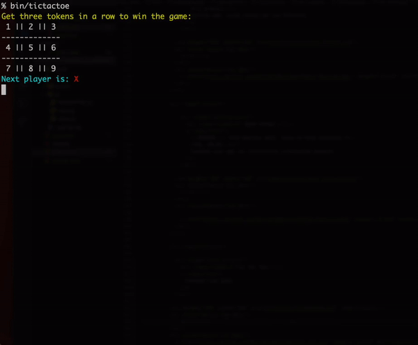

= Tic Tac Toe Game (2 player)
Benjamin Neustadt
:source-highlighter: rouge
:document-type: article 
:toc:

== Installation

Inside your terminal, download this repo with:

`git clone https://github.com/BenjaminNeustadt/tic_tac_toe`

To install the necessary dependencies:

'bundle install'

== Usage

Play the game with:

`bin/tictactoe`

OR

`ruby bin/tictactoe`

== Spec

The testing framework used is RSpec.

To run the tests:

`rspec -fd`

== Demo

== CRC design

Initial program design planning.

                                         STORAGE CLASS
       +------------------+           +------------------+          +------------------+
       |      GAME        |           |      BOARD       |          |      PLAYER      |
       +------------------+           +------------------+          +------------------+
       |                  |           |* responsible for |          |* responsible     |
       |                  |           | keeping track    |          |  for providing   |
       |                  <|---------+| of plays on      |          |  location for    |
       |* says which      |           | board            |          |  move            |
       |  players turn    |           |                  |          |                  |
       |  it is           |           |                  |          |                  |
       |* maintains rules |           |                  <|---------+                  |
       |                  |           |                  |          |                  |
       +----.--------+----+           +------------------+          +---.--------------+
           /_\       |                                                 /_\ 
            |        +--------------------------------------------------+
            |
            +------------------------+
                                     |
                 SCRIPT              |
         \\\\\\\\\\\\\\\\\\\\\\\     |
         \ +---------------------+   |
         \ |+-------------------+|   |
         \ || * responsible for ||   |
         \ ||   prompt          ||   |
         \ ||   and input       |+---+
         \ ||                   ||
            +-------------------+

